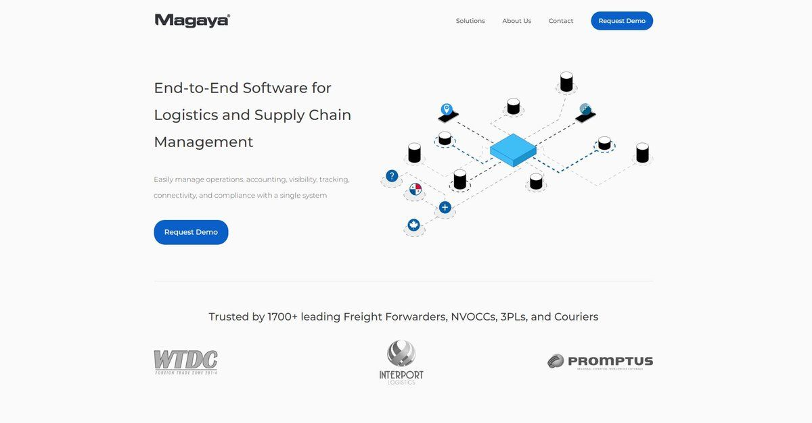

<div align="center">
  
</div>

<h4 align="center">
 Website redesign for <a href="https://www.magaya.com" target="_blank">Magaya</a>, an end-to-end software for logistics and supply chain management. Built with <a href="https://www.reactjs.org/" target="_blank">React</a> and hosted on <a href="https://www.netlify.com/" target="_blank">Netlify</a>
</h4>

<p align="center">
  <a href="https://app.netlify.com/sites/orlandoarnosa/deploys" target="_blank">
    
  </a>
</p>

<p align="center">
  <a href="#how-to-use">How To Use</a> •
  <a href="#color-reference">Color Reference</a> •
  <a href="#license">License</a>
</p>



## How To Use

To clone and run this application, you'll need [Git](https://git-scm.com) and [Node.js](https://nodejs.org/en/download/) (which comes with [npm](http://npmjs.com)) installed on your computer. From your command line:

```bash
# Clone this repository
$ git clone https://github.com/oarnosa/magaya.git

# Go into the repository
$ cd magaya

# Install dependencies
$ npm install

# Run the app
$ npm start
```

## Color Reference

<table style="width:100%">
  <tr>
    <th>Color</th>
    <th>RGB</th>
    <th>HEX</th>
  </tr>
  <tr align=center>
    <td>White</td>
    <td>rgb(250, 250, 250)</td>
    <td>#FAFAFA</td>
  </tr>
  <tr align=center>
    <td>Dark Gray</td>
    <td>rgb(60, 60, 60)</td>
    <td>#3C3C3C</td>
  </tr>
  <tr align=center>
    <td>Light Gray</td>
    <td>rgb(240, 240, 240)</td>
    <td>#F0F0F0</td>
  </tr>
  <tr align=center>
    <td>Dark Blue</td>
    <td>rgb(34, 2, 159)</td>
    <td>#22029F</td>
  </tr>
  <tr align=center>
    <td>Blue</td>
    <td>rgb(10, 95, 200)</td>
    <td>#0A5FC8</td>
  </tr>
  <tr align=center>
    <td>Light Blue</td>
    <td>rgb(28, 117, 250)</td>
    <td>#1C75FA</td>
  </tr>
</table>

## License

- **[MIT license](http://opensource.org/licenses/mit-license.php)**
- While the code is free to use and distribute as it was built by myself, <a href="http://orlandoarnosa.com" target="_blank">Orlando Arnosa</a>, all images, videos, logos, and assets are owned by <a href="http://www.magaya.com" target="_blank">Magaya Corporation</a>.
